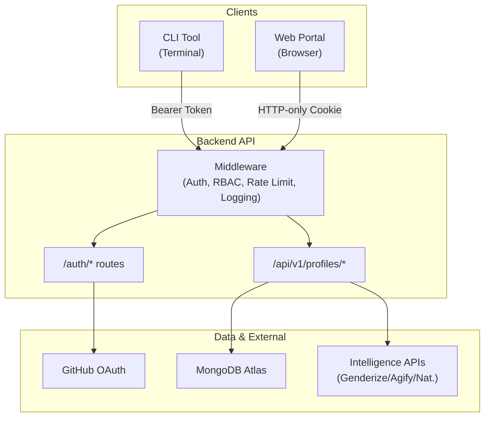

# 🚀 Insighta Labs+: Secure Access & Multi-Interface Integration

[](https://github.com/<user>/<repo>/actions)
[](https://opensource.org/licenses/MIT)

Insighta Labs+ is a comprehensive Profile Intelligence System that aggregates demographic data, provides advanced querying capabilities (including natural language search), and enforces secure, role-based access across multiple interfaces (CLI and Web).

## 🏗️ System Architecture

The platform is structured into three distinct components that communicate with a unified Backend API:

1.  **Backend API (Node.js/Express)**: The core engine handling data persistence (MongoDB), external API orchestration, authentication logic, and role enforcement.
2.  **CLI Tool (Node.js/Commander)**: A globally installable terminal application for engineers and power users, featuring session persistence and auto-refreshing tokens.
3.  **Web Portal (React/Vite)**: A modern, dark-mode dashboard for non-technical analysts to visualize data, manage profiles, and perform searches.



## 🔐 Authentication Flow

We implement **GitHub OAuth 2.0 with PKCE** (Proof Key for Code Exchange) to ensure secure login across both CLI and Browser.

1.  **Initiation**: User clicks login (Web) or runs `insighta login` (CLI).
2.  **PKCE Generation**: Backend generates a `code_verifier` and a `code_challenge`.
3.  **GitHub Authorization**: User is redirected to GitHub. After approval, GitHub redirects back with an authorization `code`.
4.  **Token Exchange**: Backend exchanges the `code` + `code_verifier` for a GitHub token, fetches user data, and generates internal JWTs.
5.  **Session Establishment**:
    *   **CLI**: Returns tokens as JSON; stored at `~/.insighta/credentials.json`.
    *   **Web**: Sets **HTTP-only, Secure, SameSite** cookies.

## 🎫 Token Handling Approach

*   **Access Token**: Short-lived (15 minutes). Used for every request.
*   **Refresh Token**: Long-lived (7 days). Stored in the database (hashed) and sent only to `/auth/refresh` to obtain new access tokens.
*   **CLI Auto-Refresh**: The CLI `apiClient` uses an interceptor to detect `401 Unauthorized` errors, automatically calls the refresh endpoint, updates local storage, and retries the original request seamlessly.
*   **Web Auto-Refresh**: Similar interceptor logic using `axios` defaults to manage cookie-based sessions.

## 👮 Role Enforcement Logic

We use a Role-Based Access Control (RBAC) middleware (`authorize.js`) that checks the `role` claim in the verified JWT.

| Role | Permissions |
| :--- | :--- |
| **Admin** | Full access: Create, Read, Delete, Search, Export. |
| **Analyst** | Read-only access: List, Get, Search, Export. |

*Roles are assigned upon first login based on the `ADMIN_GITHUB_USERNAMES` environment variable.*

## 🧠 Natural Language Parsing Approach

The `nlpParser.js` utility uses a rule-based tokenization strategy to convert plain English into database filters:

*   **Tokenization**: Splits query and filters out "stop words" (e.g., "and", "the").
*   **Pattern Matching**: Maps keywords like "males", "young", "from Nigeria" to API parameters (`gender=male`, `min_age=16`, `country_id=NG`).
*   **Location Mapping**: Uses the `country-list` package to resolve country names to ISO codes.
*   **Age Logic**: Handles comparative phrases like "over 30" or "under 20".

## 💻 CLI Usage

The CLI is globally installable and manages its own configuration.

```bash
# Install
npm install -g ./insighta-cli

# Auth
insighta login
insighta whoami

# Profiles
insighta profiles list --gender male --country NG
insighta profiles search "young females from US"
insighta profiles export --format csv
```

## 🚀 Deployment

*   **Backend**: Deployed on Vercel.
*   **Web Portal**: Deployed on Vercel.
*   **Database**: MongoDB Atlas.

## 🛠️ Environment Variables

Required variables in `.env`:
* `MONGODB_URI`, `GITHUB_CLIENT_ID`, `GITHUB_CLIENT_SECRET`, `JWT_SECRET`, `FRONTEND_URL`, `ADMIN_GITHUB_USERNAMES`.
